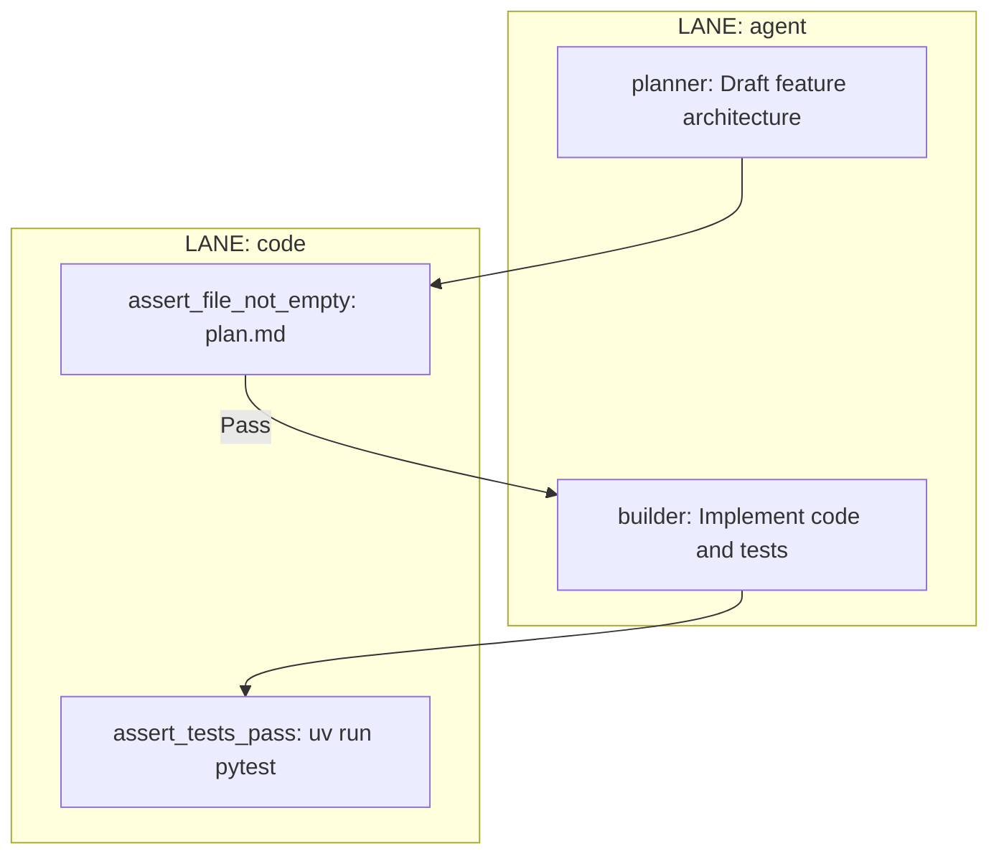

# Cookbook 01: Creating an ASF Workflow

> **Purpose:** This guide teaches autonomous agents and engineers how to create a new ASF Workflow using the dual Graph-to-Code paradigm (Mermaid.js + Python AsfWorkflow).

## 1. The Mermaid Blueprint (`.mermaid`)

Every workflow in ASF must be visually defined using Mermaid.js before it is executed. You must strictly use `subgraph` blocks to partition nodes into execution lanes.

### Rules for the Mermaid File:
1. **Lanes:** You must define at least one `LANE: agent` and one `LANE: code` subgraph.
2. **Node Typing:** 
   - Agent cognitive nodes must be tagged with `:::agent`.
   - Code deterministic nodes must be tagged with `:::code`.
3. **Data Flow:** Connections between an `agent` and a `code` node implicitly carry the Pydantic JSON `Envelope` across the boundary.

### Example: `workflows/feature_implementation.mermaid`


## 2. The Python Runner (`_runner.py`)

Once the blueprint exists, create the Python orchestration script using the `AsfWorkflow` class from `asf_core.workflow`.

### Rules for the Python Runner:
1. The execution logic must be deterministic (loops, `if/else`).
2. You must use the `with workflow.lane("lane_type"):` context manager to wrap the execution of Agno Agents or subprocess calls.
3. Handle assertion gate failures by feeding the `stderr` back into the agent's context for the Correction Loop.

### Example: `workflows/feature_implementation_runner.py`
```python
from asf_core.workflow import AsfWorkflow
from asf_core.assert_gates import run_shell_command
from src.agents.builder import get_builder_agent


def run_feature_workflow(task_description: str):
    workflow = AsfWorkflow(name="feature_implementation")
    builder = get_builder_agent()

    # 1. Agent Lane: Cognition
    with workflow.lane("agent"):
        response = builder.run(task_description)
        envelope = response.data  # This is the Pydantic Envelope

    # 2. Code Lane: Verification Gate
    with workflow.lane("code"):
        success, stdout, stderr = run_shell_command("uv run pytest")

    # 3. Correction Loop
    if not success:
        with workflow.lane("agent"):
            # Re-prompt in the same session
            correction_prompt = f"Tests failed. Please fix:\n{stderr}"
            builder.run(correction_prompt)


if __name__ == "__main__":
    run_feature_workflow("Implement user login API")
```
